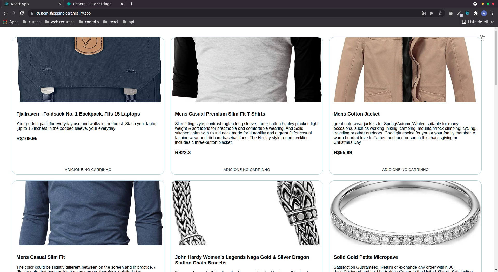
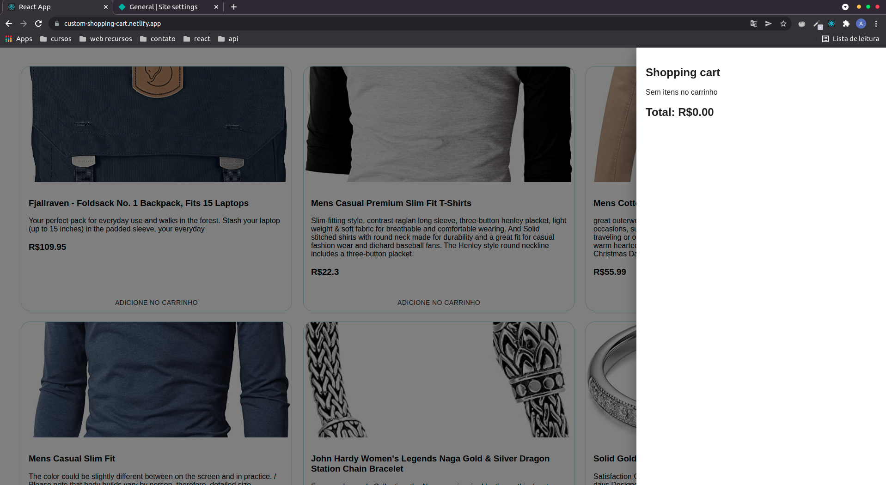
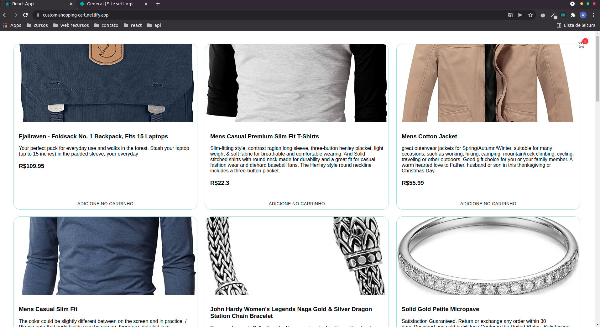
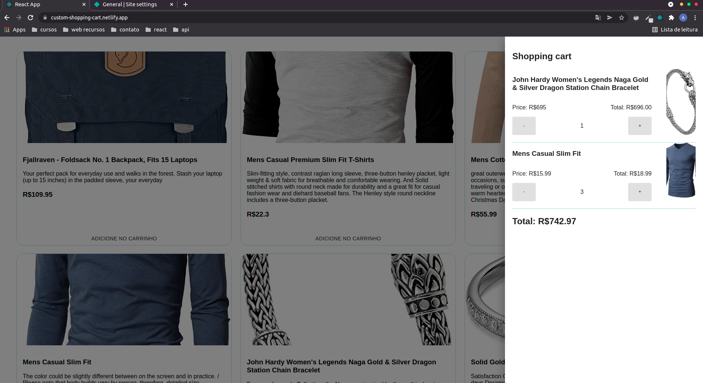

# Shopping cart com React

## Descrição do projeto
Uma aplicação de carrinho de compras, desenvolvida com react e typescript, consumindo uma api free `fake store api`. Adicionando, removendo e calculando o total de itens adicionados ou removidos do carrinho. Este projeto mais simples, tem como objetivo, colocar em prática, meus estudo com react e principalmente typescript. 

## Deploy da aplicação

[custom-shopping-cart.com](custom-shopping-cart.netlify.app)

## Tecnologias utilizadas
- Typescript
- React
- Material ui
- Styled Components
- React Query

## Como utilizar este projeto
- Clone este repositório
- Abra o terminal na pasta do projeto
- No terminal, digite ` npm i ` para instalar as dependências necessárias
- Após instalar as dependências, ainda no terminal, digite o comando ` npm start ` para inicializar o projeto

## Comandos necessários
`npm i` = para instalar as dependências
`npm start ` = para inicializar a aplicação ( em ` localhost:3000 `)

## Imagens do projeto

### Home

### Carrinho

### Carrinho Icon

### Carrinho Items

